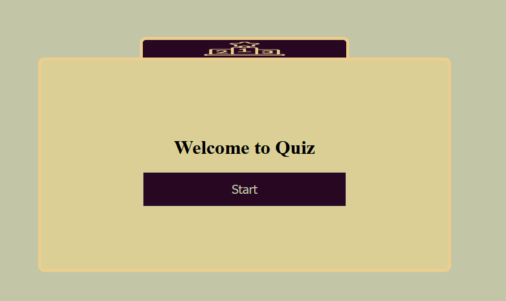

# A2 Quiz

## Short description of solution

I started by creating some classes that I could use to run my game. These I boiled down to gameHandler, stateHandler, renderHandler, postHandler and logicHandler. Where the game is ran through gameHandler and rendered on page through renderHandler. Switching through the different parts of the quiz are done through the stateHandler. Grabbing and submitting questions is done through postHandler and logicHandler keeps track of all important stuff for the player.

It works by asking for the players name then requesting the first question, after every answer it posts a request to the server for the new question if the answer was correct. Then it displays the new question together with its answer possibilities.

After the finished round it updates the highscore list. Which is accessed through the button uptop.

## Explanation of how you could run the game.

By using your terminal use the following command:

- git clone git@gitlab.lnu.se:1dv528/student/rs223dj/a2-quiz.git
- cd a2-quiz
- npm run serve
- navigate in ur browser to http://localhost/5173/

## Rules of the game

- Complete all the questions that show up on the screen within its timeframe, if you answer incorrectly you lose.
- Your score is based on accumulated time during the quiz.
- View the highscore by clicking the icon on top of the quiz.

## Linters usage

Linters are used by navigating to the folder then running the command
- cd a2-quiz
- npm run lint

Supervised by Mikael Roos
